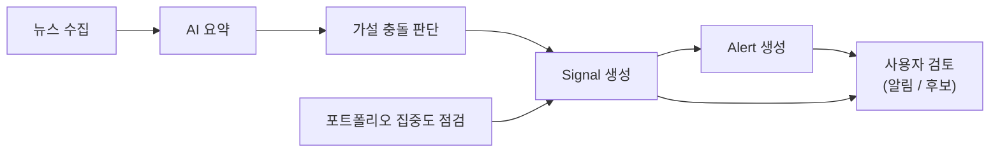

# project_stock

## 프로젝트 목적

`project_stock`는 투자 리서치와 감시 흐름을 지원하는 FastAPI 기반 MVP입니다.
뉴스 수집, AI 요약, 투자 가설과의 충돌 판단, Signal/Alert 생성, 포트폴리오
집중도 점검을 통해 사람이 투자 판단에 필요한 변화를 빠르게 확인하도록 돕습니다.

## 전체 플로우

백그라운드 분석이 뉴스를 가공해 Signal/Alert를 만들고, 사용자는 API로 그 결과와
포트폴리오·체크리스트를 확인합니다. 단계별 상세는
[docs/knowledge/product-workflow.md](docs/knowledge/product-workflow.md)를 참고하세요.



## 기술 스택

- Python 3.12, FastAPI, Uvicorn
- SQLAlchemy 2.0, Alembic, PostgreSQL 16
- Redis 7, RQ
- Pydantic Settings, python-dotenv
- python-jose(JWT), passlib[bcrypt]
- OpenAI SDK, feedparser
- uv
- 개발 도구: pytest, pytest-cov, ruff, mypy

## 로컬 실행

Backend v0.2 기준으로 로컬 실행부터 API 호출, provider 전환, 프론트엔드 연동
주의사항, 테스트까지 한 번에 따라가려면
[docs/backend-v0.2.md](docs/backend-v0.2.md)를 먼저 참고하세요.

의존성을 설치합니다.

```bash
uv sync
```

환경 파일을 준비합니다.

```bash
cp .env.example .env
```

`APP_ENV`는 실행 환경을 `dev`, `test`, `prod` 중 하나로 표시하며 기본값은 `dev`입니다.
설정은 `app/core/config.py`의 단일 `Settings`가 `.env`와 프로세스 환경 변수에서
로드합니다. `OPENAI_API_KEY`, `SECRET_KEY`, DB/Redis URL 같은 민감 정보는 실제 값을
커밋하지 말고 로컬 `.env`나 배포 환경 변수로 주입하세요. `MARKET_PROVIDER`,
`NEWS_PROVIDER`, `DISCLOSURE_PROVIDER`, `PORTFOLIO_PROVIDER`는 `mock` 또는 `real`을
사용하며, 로컬 기본값은 deterministic mock adapter입니다.

로컬에서 PostgreSQL과 Redis를 직접 실행하는 경우 `.env`의 호스트를 로컬 환경에
맞게 조정합니다. 예를 들어 Docker Compose 밖에서 API를 실행하고 로컬 포트로
접속한다면 `DATABASE_URL`의 호스트는 `localhost`, `REDIS_URL`의 호스트도
`localhost`가 되어야 합니다.

마이그레이션을 적용합니다.

```bash
uv run alembic upgrade head
```

API 서버를 실행합니다.

```bash
uv run uvicorn app.main:app --reload
```

기본 API 주소는 `http://127.0.0.1:8000`이고, 주요 API prefix는 `/api/v1`입니다.

## Docker Compose 실행

API, PostgreSQL, Redis를 함께 실행합니다.

```bash
docker compose up --build
```

Compose 구성의 API 컨테이너는 `uv run uvicorn app.main:app --host 0.0.0.0 --port 8000 --reload`로
시작하며 호스트의 `8000` 포트에 노출됩니다.

종료합니다.

```bash
docker compose down
```

데이터 볼륨까지 제거하려면 Docker의 볼륨 삭제 옵션을 별도로 사용하세요.

## Alembic

Alembic은 `alembic/env.py`에서 `DATABASE_URL`을 읽고 전체 도메인 모델을
`Base.metadata`에 등록해 autogenerate 대상에 포함합니다.

현재 스키마까지 마이그레이션을 적용합니다. 새 로컬 DB를 준비한 뒤 이 명령만으로
현재 head까지 재현되어야 합니다.

```bash
uv run alembic upgrade head
```

현재 head가 하나인지 확인합니다.

```bash
uv run alembic heads
```

모델 변경 후 새 마이그레이션 초안을 생성합니다.

```bash
uv run alembic revision --autogenerate -m "describe change"
```

생성된 revision은 실제 의도와 일치하는지 검토한 뒤 커밋합니다. 의도하지 않은
테이블/컬럼 diff가 보이면 revision을 커밋하기 전에 모델 import 누락 또는 기존
마이그레이션과의 불일치를 먼저 확인하세요.

직전 revision으로 되돌립니다.

```bash
uv run alembic downgrade -1
```

전체 마이그레이션 왕복 검증이 필요할 때는 로컬 검증 DB에서만 base까지 내린 뒤
다시 head까지 올립니다.

```bash
uv run alembic downgrade base
uv run alembic upgrade head
```

## 테스트 실행

전체 테스트를 실행합니다.

```bash
uv run pytest
```

PR 전 권장 검증 명령은 다음과 같습니다.

```bash
uv run ruff check .
uv run mypy .
uv run pytest
```

테스트 구조와 실행 방식의 상세 설명은 [docs/testing.md](docs/testing.md)를 참고하세요.

## 주요 API

모든 라우터는 `/api/v1` 아래에 연결됩니다.
프론트엔드 화면별 연동 명세는 [docs/api/frontend-api-spec.md](docs/api/frontend-api-spec.md)를 참고하세요.

| Prefix | 설명 |
| --- | --- |
| `/api/v1/health` | 서비스 상태 확인 (liveness, `/readiness`에서 의존성·provider·version 점검) |
| `/api/v1/auth` | 사용자 등록, 로그인, 현재 사용자 조회 |
| `/api/v1/alerts` | 알림 목록 조회, 읽음 처리, 숨김 처리 |
| `/api/v1/alert-candidates` | 알림 후보 목록 조회, 읽음 처리, 확정 처리 |
| `/api/v1/assets` | 투자 자산 등록, 목록 조회, 단건 조회 |
| `/api/v1/watchlists` | 관심종목 목록과 항목 관리 |
| `/api/v1/portfolios` | 포트폴리오, 포지션, 집중도 점검 |
| `/api/v1/theses` | 투자 가설 생성, 수정, 조회, 비활성화 |
| `/api/v1/reports` | 리서치 리포트 생성과 조회 |
| `/api/v1/signals` | 투자 시그널 생성과 조회 |
| `/api/v1/job-runs` | 백그라운드 잡 실행 기록 조회 |
| `/api/v1/worker` | 뉴스 수집과 관심종목 분석 잡 enqueue |

## 마일스톤 범위와 제외

v0.1 MVP 범위는 투자 리서치/감시 흐름입니다. 포함되는 흐름은 뉴스 수집,
AI 요약, 투자 가설 충돌 판단, Signal/Alert 생성, 포트폴리오 집중도 점검입니다.

v0.2는 이 흐름을 프론트엔드 연동과 운영이 가능한 수준으로 다듬은 백엔드
마일스톤입니다. 주요 변경은 다음과 같습니다. 통합 가이드는
[docs/backend-v0.2.md](docs/backend-v0.2.md)를 참고하세요.

- deterministic mock data provider와 `*_PROVIDER` 환경 변수 기반 provider 전환
- 종목 기본 정보 상세, 리서치 요약, 매수 전 체크리스트 API
- 관심종목 항목 사유/태그/메모와 항목 목록 조회 API
- 포트폴리오 요약 확장(시세 평가금액, 섹터/현금 비중)과 알림 후보(alert-candidates) 도메인
- 목록 공통 pagination/sort 규칙, CORS 설정, `APP_ENV` 기반 설정 구조 정리
- DB 마이그레이션 구조 정리, 주요 API·계약 스냅샷 테스트 보강
- request id·민감정보 마스킹 로깅, liveness/readiness 분리 health check, 스케줄러 스켈레톤

자동매매(automated trading)는 v0.1과 v0.2 범위가 아닙니다. 이 프로젝트는 주문 실행,
브로커 연동, 실거래 자동화, 포지션 자동 조정 기능을 제공하지 않습니다.
