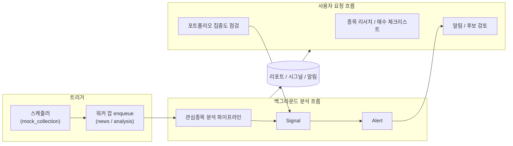
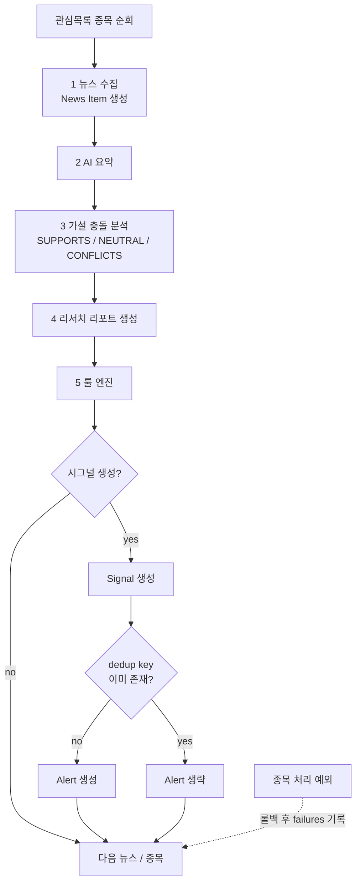
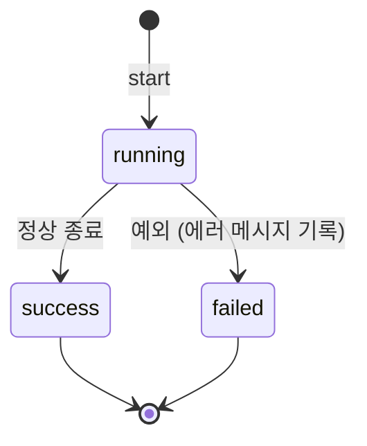

# Product Workflow

이 문서는 `project_stock` 제품의 런타임 흐름을 설명한다. 개발/하네스 절차인
[workflow.md](workflow.md)와 별개로, 시스템이 실제로 데이터를 어떻게 처리하는지를
다룬다. 비즈니스 규칙은 [domain-knowledge.md](domain-knowledge.md), API 계약은
[../api/frontend-api-spec.md](../api/frontend-api-spec.md)를 기준으로 한다.

## 큰 그림

투자 리서치/감시 흐름은 세 갈래로 나뉜다.

- **데이터 수집 흐름**: 외부 provider에서 가격·뉴스 원시 데이터를 받아 원본 아카이브·검증을
  거쳐 정규화 테이블에 적재한다. 이후 분석 흐름과 (후속) LLM 입력의 재료가 된다.
- **백그라운드 분석 흐름**: 수집된 뉴스를 분석해 리포트와 Signal/Alert를 생성한다.
  RQ 워커 잡 또는 스케줄러가 트리거한다.
- **사용자 요청 흐름**: 사용자가 API로 포트폴리오 점검, 매수 전 체크, 알림/후보
  검토 등 판단 보조 기능을 직접 호출한다.

provider(`market`/`news`/`disclosure`/`portfolio`)는 모드별로 주입되며, 로컬·테스트 기본값은
deterministic mock이다. `market`은 `mock` / `yfinance`(일봉 실수집) / `real`을, `news`는
`mock` / `rss`(회사명 쿼리 실수집) / `real`을 지원하고, 나머지는 `mock` / `real`이다.

## 관심종목 분석 파이프라인

핵심 백그라운드 흐름이다. `analyze_watchlist_job`(RQ 잡)이 `WatchlistAnalysisService`를
실행하며, 관심목록의 각 종목을 순회한다. 종목 단위로 트랜잭션을 처리하고, 한 종목이
실패하면 롤백 후 `failures`에 기록하고 다음 종목으로 넘어간다.

종목별 처리 순서:

1. **뉴스 수집**: news adapter로 종목 심볼의 원시 뉴스를 수집·저장하고 News Item을 만든다.
2. **AI 요약**: 각 News Item을 LLM으로 요약한다.
3. **가설 충돌 분석**: 종목의 최신 투자 가설과 뉴스를 비교해 충돌 상태
   (`SUPPORTS` / `NEUTRAL` / `CONFLICTS`)와 무효화 조건 충족 여부(`invalidation_triggered`)를 판정한다.
4. **리서치 리포트 생성**: 요약·가설 충돌 결과를 담은 리포트를 만든다.
5. **룰 엔진 → 시그널**: 아래 규칙으로 Signal을 생성한다.
6. **알림 생성**: 생성된 Signal마다 사용자 Alert를 만든다. 중복 키(dedup key)가 이미
   있으면 새 Alert를 만들지 않는다.

집계 결과(`AnalysisFlowResult`)로 처리 종목 수와 생성된 news item / report / signal /
alert 수, 그리고 실패 목록을 반환한다.

> 종목 단위 트랜잭션이다. 한 종목이 실패하면 롤백하고 `failures`에 남긴 뒤 다음 종목으로 넘어간다.

### 룰 엔진 규칙

기본 규칙(`default_rules`)은 두 가지이며, News Item과 가설 충돌 결과를 입력으로 받는다.

- **High-impact 뉴스 규칙**: News Item의 영향도가 `HIGH` 또는 `CRITICAL`이면
  `RISK_ALERT` 시그널을 만든다(점수 `CRITICAL`=80, `HIGH`=60).
- **가설 충돌 규칙**: `invalidation_triggered`면 `THESIS_BROKEN`(risk `CRITICAL`, 점수 90),
  충돌 상태가 `CONFLICTS`면 `RISK_ALERT`(risk `HIGH`, 점수 70). 그 외에는 생성하지 않는다.

## 뉴스 수집 잡

`collect_news_job`(RQ 잡)은 회사명 쿼리로 원시 뉴스를 실수집한다. `NEWS_PROVIDER=rss`일 때
Google News 검색 RSS를 종목별 쿼리로 호출한다. 분석 파이프라인과 달리 요약·시그널 단계 없이
수집만 수행한다. 처리 순서:

1. **universe 산출**: 인자로 심볼을 주지 않으면 관심종목(watchlist) + 보유종목(portfolio)의
   `(symbol, market)` 합집합을 대상으로 삼고, 각 대상의 회사명(`assets.name`)을 함께 싣는다.
   심볼을 명시하면 assets에서 조회하고 미존재 심볼은 경고 후 건너뛴다.
2. **쿼리 수집**: 종목별로 회사명을 쿼리에 넣어 RSS를 호출한다. market별 locale을 부여해
   (KOSPI/KOSDAQ→`ko/KR`, NASDAQ/NYSE→`en-US/US`, 미지 market은 기본 locale + 경고로
   fail-open) 한국·미국 종목을 모두 커버한다.
3. **종목 태깅 저장**: per-company 쿼리라 반환 기사를 전부 대상 `(symbol, market)`에 귀속시켜
   `raw_news_events`에 저장한다. `url` unique 제약으로 동일 기사 재수집은 스킵한다(멀티종목
   기사는 first-writer-wins).

종목 단위 실패는 격리되어 다음 종목으로 넘어가고, 잡 전체는 JobRun으로 추적한다. 이 잡은
LLM을 호출하지 않는다 — 산출물은 `raw_news_events` 적재까지이며, 정규화(News Item)·요약·
시그널은 분석 파이프라인의 범위다. 두 잡 모두 JobRun으로 실행을 기록한다(아래).

## 가격 수집 잡

`collect_prices_job`(RQ 잡)은 일봉 가격을 실수집한다. `MARKET_PROVIDER=yfinance`일 때
yfinance 단일 provider가 시장 suffix(`.KS`/`.KQ`)로 미국·한국을 모두 커버한다. 처리 순서:

1. **universe 산출**: 인자로 심볼을 주지 않으면 관심종목(watchlist) + 보유종목(portfolio)의
   `(symbol, market)` 합집합을 대상으로 삼는다.
2. **수집**: provider로 일봉을 받는다. 미지 market은 fail-closed로 건너뛴다(경고).
3. **원본 아카이브**: 정규화 전 원본 payload를 `raw_prices`에 저장한다. `payload_hash`가
   이미 있으면 재저장하지 않는다(중복 스킵).
4. **검증**: 결측·미래 날짜 bar는 drop, 통화 불일치·이상치(전일 대비 수익률 절대값이 임계
   초과)는 경고하되 유지한다.
5. **적재**: 검증 통과분을 `prices`에 upsert한다. unique 제약(symbol·market·interval·
   timestamp)으로 중복을 흡수해 재수집이 멱등이다.

종목 단위 실패는 격리되어 다음 종목으로 넘어가고, 잡 전체는 JobRun으로 추적한다. 이 잡은
LLM을 호출하지 않는다 — 산출물은 `prices`·`raw_prices` 적재까지이며, Feature 계산·Context
조립·LLM 입력 패키징은 후속 범위다.

## 스케줄러

스케줄러는 현재 스켈레톤이다. 레지스트리에 등록된 잡(`mock_collection`, cron
`*/15 * * * *`)을 실제 주기 트리거 없이 수동 실행하는 경로만 제공한다
(`POST /api/v1/worker/scheduler/jobs/{job_name}/run`). 실제 주기 실행 연결은 후속 범위다.
설계 배경은 [ADR-003](../decisions/ADR-003-scheduler-approach.md)을 참고한다.

## JobRun 생명주기

백그라운드 잡은 JobRun으로 추적된다.

- 시작 시 `running` 상태로 기록한다.
- 정상 종료 시 `success`로 갱신한다.
- 예외 발생 시 `failed`로 갱신하고 에러 메시지를 남긴다.
- 분석 잡은 종목별 부분 실패를 JobRun에 함께 기록한다.

실행 기록은 `GET /api/v1/job-runs`로 조회한다. (RQ enqueue 응답의 `queued`는 큐 적재
상태이며 JobRun 상태와 별개다.)

## 사용자 요청 흐름

분석 파이프라인이 만든 데이터를 사용자가 API로 소비·판단하는 흐름이다.

- **종목 리서치**: 종목 기본 정보·시세(mock), 리서치 요약, 매수 전 체크리스트를 조회한다.
  체크리스트는 필수 4개 항목 체크와 memo 입력이 모두 충족되면 완료로 판정한다.
- **포트폴리오 집중도 점검**: 요약(섹터/현금 비중 포함)을 조회하고 점검을 실행한다.
  시세 기반 비중이 `concentration_threshold`를 초과한 종목에 대해 시그널을 만든다.
- **알림 검토**: Alert를 읽음/숨김 처리한다. 발송 전 Alert Candidate는 사람이 검토해
  읽음/확정한다(상태 전이 순서는 강제하지 않는다).
- **가설 관리**: 투자 가설을 생성·수정·비활성화한다. 분석 파이프라인은 종목의 최신
  활성 가설을 충돌 분석 입력으로 사용한다.

## 관련 문서

- [domain-knowledge.md](domain-knowledge.md): 비즈니스 규칙·도메인 용어·정책 결정.
- [llm-data-pipeline.md](llm-data-pipeline.md): 외부 데이터→정규화·검증·Feature·ContextBundle→LLM 파이프라인 전체 지침.
- [../api/frontend-api-spec.md](../api/frontend-api-spec.md): 화면별 API 매핑과 catalog.
- [../backend-v0.2.md](../backend-v0.2.md): 로컬 실행·provider 전환·API 호출 가이드.
- [../designs/019-watchlist-analysis-flow.md](../designs/019-watchlist-analysis-flow.md): 분석 플로우 설계.
- [../designs/020-rule-engine.md](../designs/020-rule-engine.md): 룰 엔진 설계.
- [../designs/065-price-ingestion-pipeline.md](../designs/065-price-ingestion-pipeline.md): 가격 실수집 파이프라인 설계.
- [../designs/066-news-ingestion-pipeline.md](../designs/066-news-ingestion-pipeline.md): 뉴스 실수집 파이프라인 설계.
